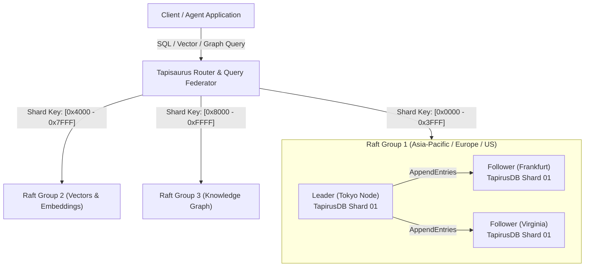

# TAPISAURUS (GrandTapirus) — Architectural & Distributed Cluster Blueprint

> **System Classification:** Planet-Scale Multi-Model Distributed Database & AI Agent Coordination Mesh  
> **Author & Architect:** Ahmad Faiz (TapirusLab / TapirusDB)  
> **Specification Version:** 1.0.0-PROTOTYPE  
> **Ecosystem Continuum:** TapirusDB v0.1.2 (Micro-Shard) $\rightarrow$ Tapisaurus v0.3.0+ (Distributed Cloud & Edge Mesh)  
> **Official Domains:** `tapirusdb.com` / `tapiruslab.com`  
> **License:** Business Source License 1.1 (BSL-1.1)

---

## 1. Executive Vision & The Dual-Tier Continuum

Modern AI systems and enterprise data platforms face a fundamental dilemma:
1. **Monolithic Cloud Databases (PostgreSQL, Snowflake, Pinecone):** High latency, expensive cloud ingress/egress, heavy operational overhead, impossible to embed inside robots, drones, satellites, or client browsers.
2. **Traditional Embedded Databases (e.g., SQLite):** Fast locally, but cannot scale across multiple nodes, lack native distributed consensus, and cannot survive datacenter failures.

**Tapisaurus (GrandTapirus)** solves this by formulating a **Continuous Dual-Tier Continuum**:

```text
                                  TAPIRUS DATABASE CONTINUUM
                                               │
             ┌─────────────────────────────────┴─────────────────────────────────┐
             ▼                                                                   ▼
        TAPIRUSDB                                                          TAPISAURUS
     (Embedded Micro-Titan)                                           (Distributed Scale-Out)
  • Single `.tapir` file format                                     • Planet-scale Multi-Raft cluster
  • Ultra-compact (< 4 MB idle RAM)                                 • Millions of autonomous micro-shards
  • 100% Safe-Rust in-process engine                                • Active-active geo-distributed replication
  • Zero external runtime daemons                                   • Scatter-gather query federator
  • Best for: Edge AI, mobile, local SLMs,                          • Best for: Global enterprise RAG, aerospace fleets,
    wearables, browser WASM, robotics                                 autonomous vehicle swarms, petabyte AI corpora
```

---

## 2. Core Architectural Pillars

### Pillar 1: The Micro-Shard Fabric
Rather than deploying massive nodes with hundreds of gigabytes of RAM contending on a single buffer pool, Tapisaurus organizes cluster data into **thousands of autonomous TapirusDB micro-shards**.

* Each micro-shard is a self-contained, independent TapirusDB database instance ($< 4\text{ MB}$ RAM footprint).
* A single commodity server with 64 GB RAM can concurrently host over **10,000 active micro-shards** with zero cross-shard lock contention.
* If a single micro-shard crashes or corrupts, only that tiny partition is affected; the rest of the cluster operates uninterrupted.

### Pillar 2: Multi-Raft Consensus Layer
Tapisaurus organizes micro-shards into discrete **Multi-Raft Consensus Groups**:



* **Zero Recovery Point Objective ($\text{RPO} = 0$):** Every write is committed to a quorum of WAL logs before returning success.
* **Sub-Second Recovery ($\text{RTO} < 1\text{ s}$):** Automatic leader election occurs in $< 300\text{ ms}$ upon node failure.

### Pillar 3: Hybrid Logical Clocks (HLC)
To order transactions across global regions without requiring expensive hardware atomic clocks (like Google Spanner's GPS/atomic clocks), Tapisaurus uses **Hybrid Logical Clocks (HLC)** combining physical system time with logical counters:

$$\text{HLC}_i = \max(l_i, \text{physical time}(), l_m + 1)$$

This guarantees strict causal consistency across continents (Asia, Europe, Americas) with sub-millisecond coordination.

---

## 3. Distributed Quad-Model Query Federation

Tapisaurus does not compromise single-node speed when executing distributed queries. The query coordinator breaks high-level queries into localized micro-tasks using the **Scatter-Gather Engine**:

### A. Distributed Vector Search (Hierarchical 2-Tier HNSW)
1. **Tier-1 (Global Centroids):** The Coordinator maintains a coarse quantization index of cluster shard centroids.
2. **Tier-2 (Local HNSW):** The query vector is routed exclusively to the top-$N$ candidate shards, where each TapirusDB shard executes sub-millisecond local HNSW retrieval.
3. **Federated Merge:** The Coordinator merges the top-$K$ candidates using a priority heap.

### B. Distributed Property Graph Traversal
Graph edges that link entities residing on different nodes are marked as `FederatedEdge(target_shard_id, remote_node_id)`:
* Traversal executes locally until a boundary edge is hit.
* The coordinator issues asynchronous batch RPCs to downstream shards to resume BFS/DFS traversal.

---

## 4. Rust Implementation Blueprint (`crates/tapisaurus-cluster`)

Below is the concrete software design for the distributed crate:

```rust
// Proposed crate structure: crates/tapisaurus-cluster
// File: src/shard.rs

use std::sync::Arc;
use tapirus::{Connection, Result};

/// Represents a single autonomous partition managed by the cluster
pub struct MicroShard {
    pub shard_id: u64,
    pub range_start: u64,
    pub range_end: u64,
    pub engine: Arc<Connection>,
}

impl MicroShard {
    pub fn open(shard_id: u64, path: &std::path::Path) -> Result<Self> {
        let engine = Connection::open(path)?;
        Ok(Self {
            shard_id,
            range_start: 0,
            range_end: u64::MAX,
            engine: Arc::new(engine),
        })
    }
}
```

```rust
// File: src/coordinator.rs

use crate::shard::MicroShard;
use std::collections::HashMap;
use parking_lot::RwLock;

/// Global Coordinator routing queries to appropriate micro-shards
pub struct TapisaurusCoordinator {
    shards: RwLock<HashMap<u64, MicroShard>>,
    routing_table: RwLock<Vec<(u64, u64, u64)>>, // (start_hash, end_hash, shard_id)
}

impl TapisaurusCoordinator {
    pub fn new() -> Self {
        Self {
            shards: RwLock::new(HashMap::new()),
            routing_table: RwLock::new(Vec::new()),
        }
    }

    /// Execute a federated SQL query across all shards and merge rows
    pub fn federated_query(&self, sql: &str) -> tapirus::Result<Vec<tapirus::Row>> {
        let shards = self.shards.read();
        let mut combined_rows = Vec::new();

        // Scatter query to relevant shards
        for (_, shard) in shards.iter() {
            let rows = shard.engine.query(sql)?;
            combined_rows.extend(rows);
        }

        // Gather & Deduplicate
        Ok(combined_rows)
    }
}
```

---

## 5. Engineering Roadmap (v0.2 to v1.0)

| Phase | Milestone | Deliverables | Target Date |
|:---|:---|:---|:---|
| **Phase 1** | **Local Multi-Shard Prototype** | `crates/tapisaurus-cluster`, in-memory shard partitioning, basic scatter-gather SQL. | Q4 2026 |
| **Phase 2** | **Network & Raft Protocol** | gRPC wire protocol, integration with `openraft`, 3-node cluster quorum tests. | Q1 2027 |
| **Phase 3** | **Distributed Vector & Graph** | Tier-1 centroid vector routing, boundary graph edge RPC, cross-region replication. | Q2 2027 |
| **Phase 4** | **Commercial DBaaS & K8s Mesh** | Tapisaurus Cloud console, Kubernetes Operator, automated split/merge rebalancing. | Q3 2027 |

---

## 6. Confidentiality & Transition Notes

* **Development Workspace:** Confidential internal engineering sandbox.
* **Target Public Organizations:** `TapirusLab` / `TapirusDB` on GitHub.
* **Target Commercial Domains:** `tapirusdb.com` / `tapiruslab.com`.
* **Zero Brand Leakage:** Project is independent of third-party branding; positioned as a global sovereign deep-tech database enterprise.

---
*© 2026 TapirusLab. All Rights Reserved. Confidential Engineering Blueprint.*
